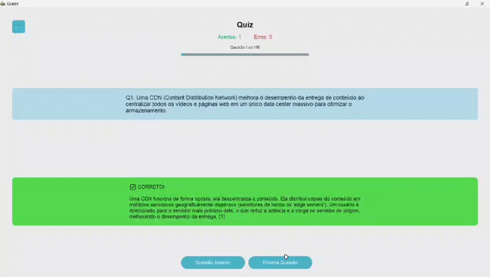

# QuizzV: Gerador de Quizzes com Inteligência Artificial


 
Bem-vindo ao **QuizzV**, um aplicativo de desktop inovador construído com **Python** e a moderna biblioteca **CustomTkinter**. O QuizzV transforma a tarefa de criação de quizzes em um processo rápido, inteligente e automatizado.

Utilizando o poder da **Inteligência Artificial (IA) da API do Gemini**, ele gera quizzes relevantes sobre tópicos gerais ou extrai perguntas e respostas diretamente de documentos, como arquivos PDF.

Esta é uma ferramenta indispensável para:
- **Estudantes** que buscam otimizar suas rotinas de estudo.
- **Educadores** que desejam criar materiais de aprendizagem engajadores.
- **Qualquer pessoa** curiosa para desafiar seus conhecimentos de forma prática.

---

## 📋 Tabela de Conteúdos
- [✨ Funcionalidades](#-funcionalidades)
- [🛠️ Tecnologias Utilizadas](#️-tecnologias-utilizadas)
- [🚀 Começando](#-começando)
- [⚙️ Configuração](#️-configuração)
- [📝 Formato dos Quizzes](#-formato-dos-quizzes-json)
- [👨‍💻 Autor](#-autor)

---

## ✨ Funcionalidades
- **Geração de Quizzes com IA**: Crie questionários sobre qualquer assunto ou a partir de arquivos PDF.
- **Gerenciamento de Quizzes**: Importe, salve e organize seus quizzes na tela inicial.
- **Interface Altamente Personalizável**: Alterne entre os modos claro e escuro e escolha entre vários temas de cores.
- **Feedback Instantâneo**: Obtenha explicações detalhadas para cada resposta, geradas pela IA.
- **Modo de Revisão Inteligente**: Ao final de um quiz, reinicie ou refaça apenas as questões que você errou.
- **Navegação Flexível**: Volte e revise as perguntas já respondidas a qualquer momento.

---

## 🛠️ Tecnologias Utilizadas
Este projeto foi construído com as seguintes tecnologias:
- 
- 
- 
- 
- 

---

## 🚀 Começando

Existem duas maneiras de executar o QuizzV: baixando a versão pronta para uso (recomendado para usuários) ou executando o código-fonte (recomendado para desenvolvedores).

### Opção 1: Usando o Executável (Windows)
A maneira mais fácil de usar o QuizzV, não requer instalação de Python ou bibliotecas.

1.  **Acesse a Página de Releases:**
    * Vá para a seção de **[Releases](https://github.com/victor-kauan-coder/QuizzV/releases)** aqui no repositório.

2.  **Baixe a Versão Mais Recente:**
    * Procure pela release mais recente (geralmente no topo) e baixe o arquivo `.zip` (por exemplo, `QuizzV-v1.0.0.zip`).

3.  **Extraia e Execute:**
    * Descompacte (extraia) o arquivo `.zip` em uma pasta de sua preferência.
    * Abra a pasta criada e dê um duplo clique no arquivo `QuizzV.exe`.
    * Pronto! O aplicativo será iniciado.

---
### Opção 2: Executando a Partir do Código-Fonte
Para desenvolvedores que desejam modificar o código ou contribuir para o projeto.

#### Pré-requisitos
Antes de começar, garanta que você tenha os seguintes programas instalados:
* [Python](https://www.python.org/downloads/) (versão 3.8 ou superior)
* [Git](https://git-scm.com/downloads/)

#### Passos para Instalação

1.  **Clone o Repositório:**
    Abra seu terminal e clone este repositório para a sua máquina local.
    ```bash
    git clone [https://github.com/victor-kauan-coder/QuizzV.git](https://github.com/victor-kauan-coder/QuizzV.git)
    cd QuizzV
    ```

2.  **Crie e Ative um Ambiente Virtual (Recomendado):**
    Isso cria um ambiente isolado para as dependências do projeto, evitando conflitos com outros projetos Python.
    ```bash
    # Cria o ambiente virtual
    python -m venv venv

    # Ativa o ambiente (Windows)
    .\venv\Scripts\activate

    # Ativa o ambiente (macOS/Linux)
    # source venv/bin/activate
    ```

3.  **Instale as Dependências:**
    Crie um arquivo chamado `requirements.txt` na pasta raiz do projeto com o seguinte conteúdo:
    ```txt
    customtkinter
    google-generativeai
    pillow
    ```
    Em seguida, instale todas as bibliotecas de uma vez com o comando:
    ```bash
    pip install -r requirements.txt
    ```

4.  **Configure a Chave de API:**
    Para usar a geração de quizzes com IA, você precisa de uma chave de API do Gemini.
    * Obtenha sua chave no [Google AI Studio](https://aistudio.google.com/app/apikey).
    * Execute o aplicativo (próximo passo) e clique no ícone de engrenagem para ir às configurações.
    * Cole sua chave de API no campo apropriado.

5.  **Execute o Aplicativo:**
    Com tudo instalado e configurado, inicie o QuizzV com o comando:
    ```bash
    python app.py
    ```
## ⚙️ Configuração

Para que a geração de quizzes com Inteligência Artificial funcione, é essencial configurar sua chave de API do Google Gemini.

1.  **Obtenha sua Chave de API:**
    * Acesse o **[Google AI Studio](https://aistudio.google.com/app/apikey)** e gere sua chave de API gratuita.

2.  **Inicie o QuizzV:**
    * Execute o aplicativo e clique no **ícone de engrenagem (⚙️)** no canto da tela para abrir as configurações.

3.  **Insira sua Chave:**
    * Cole a chave que você gerou no campo "API Key (AI)". A chave será salva automaticamente para usos futuros.

Além da chave de API, a tela de configurações permite personalizar sua experiência:
* **Modo de Exibição**: Alterne entre os temas `Light` (Claro) e `Dark` (Escuro).
* **Cor do Tema**: Escolha entre diferentes esquemas de cores para a interface.

---

## 📝 Formato dos Quizzes (JSON)

Os quizzes criados ou importados são salvos no formato **JSON** na pasta `/quizzes`. Esta estrutura torna os arquivos fáceis de ler, editar e compartilhar.

Cada arquivo consiste em uma lista de objetos, onde cada objeto representa uma única pergunta com a seguinte estrutura:

* `question`: (String) O texto da pergunta.
* `answer`: (String) A resposta correta, que deve ser `"True"` ou `"False"`.
* `explanation`: (String) Uma justificativa detalhada sobre a resposta correta, ideal para fins de estudo.

#### Exemplo de um arquivo `quiz.json`:

```json
[
  {
    "question": "A capital do Brasil é Brasília.",
    "answer": "True",
    "explanation": "Brasília foi oficialmente inaugurada como a capital do Brasil em 1960 para promover o desenvolvimento do interior do país."
  },
  {
    "question": "A água ferve a 100°F ao nível do mar.",
    "answer": "False",
    "explanation": "A água ferve a 100°C (que é equivalente a 212°F) sob pressão atmosférica padrão ao nível do mar."
  }
]
```

## Autor

### **Victor Kauan**

[](https://github.com/victor-kauan-coder)
[](https://www.linkedin.com/in/victor-miranda-5342a6337)
