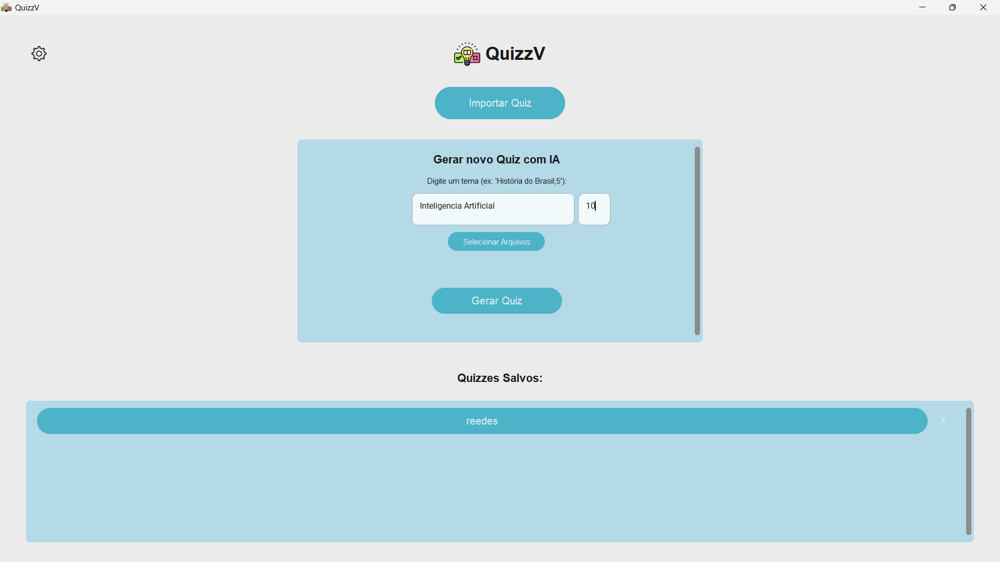

# QuizzV

# 🚀 QuizzV: AI-Powered Quiz Generator

Welcome to **QuizzV**, an innovative desktop application built with **Python** and the modern **CustomTkinter** library, designed to revolutionize how you create and engage with educational content.

QuizzV transforms the tedious task of quiz creation into a seamless and intelligent process.

At its core, it leverages the power of **Artificial Intelligence (AI)** to automatically generate relevant quizzes — either based on general topics or extracted from specific documents (like PDFs).

This makes it an indispensable tool for:

- Students seeking efficient study aids.
- Educators aiming to create engaging learning materials.
- Anyone curious to challenge their knowledge.

---

## 📋 Table of Contents

- ✨ Key Features
- 🖥️ Interface
- 📁 Project Structure
- 📝 Quiz File Format (JSON)
- 🛠️ How to Run
  - Option 1: Using the Executable (Windows)
  - Option 2: Running from Source Code
- ⚙️ Settings

---

## ✨ Key Features

- **AI-Powered Quiz Generation**:  
  Create quizzes on any subject. Provide PDF files to generate targeted quizzes.

- **Quiz Management**:  
  Import, save, and organize your quizzes. Manage them easily from the home screen.

- **Highly Customizable Interface**:

  - Switch between light and dark mode.
  - Choose from various color themes.

- **Instant Feedback**:  
  Get detailed explanations for each answer.

- **Smart Review Mode**:  
  At the end of a quiz, choose to restart everything or only retry incorrect questions.

- **Flexible Navigation**:  
  Go back and review previously answered questions.

- **Modern and Intuitive UI**:  
  A clean, modern, and user-friendly interface.

---

## 🖥️ Interface



---

## 📁 Project Structure

The project is organized for easy maintenance and development:

```
.
├── dist/
│   └── QuizzV/
│       └── QuizzV.exe      # Executable for Windows
├── image/                  # UI icons and images
├── quizzes/                # Saved quizzes (.json)
├── themes/                 # UI theme files (.json)
├── app.py                  # Main application script
├── chat.py                 # Logic for interacting with Gemini API
├── loading.py              # Loading animation widget
├── settings.json           # User settings file
└── app.spec                # PyInstaller configuration file
```

---

## 📝 Quiz File Format (JSON)

Quizzes are stored in **JSON format**, which is flexible and robust.  
Each file contains a **list of objects**, where each object represents a question.

### Expected structure:

- **question**: The text of the question.
- **answer**: The correct answer (`"True"` or `"False"`).
- **explanation**: A detailed justification.

### Example:

```json
[
  {
    "question": "The capital of Brazil is Brasília.",
    "answer": "True",
    "explanation": "Brasília was officially inaugurated as the capital of Brazil in 1960 to promote the development of the country's interior."
  },
  {
    "question": "Water boils at 100°F at sea level.",
    "answer": "False",
    "explanation": "Water boils at 100°C (which is equivalent to 212°F) under standard atmospheric pressure at sea level."
  }
]
```

---

## 🛠️ How to Run

### Option 1: Using the Executable (Windows)

The easiest way, no Python required:

1. Navigate to the `dist/QuizzV/` folder.
2. Double-click `QuizzV.exe`.
3. Done! The home screen will appear and you can start using it.

---

### Option 2: Running from Source Code

For developers or users who prefer running directly from source:

```bash
git clone https://github.com/your-username/QuizzV.git
cd QuizzV
pip install customtkinter google-generativeai pillow
python app.py
```

⚠️ **Important**: To use the AI-powered quiz generation, you need an **API Key** from Google AI Studio.  
On your first launch, go to **Settings (gear icon)** and enter your key.

---

## ⚙️ Settings

The settings screen allows customization:

- **API Key (AI)**: Enter your Gemini API key.
- **Display Mode**: Switch between light and dark themes.
- **Theme Color**: Choose different color schemes.

---

**Victor Kauan**

[](https://github.com/victor-kauan-coder)
[](https://www.linkedin.com/in/victor-miranda-5342a6337)
