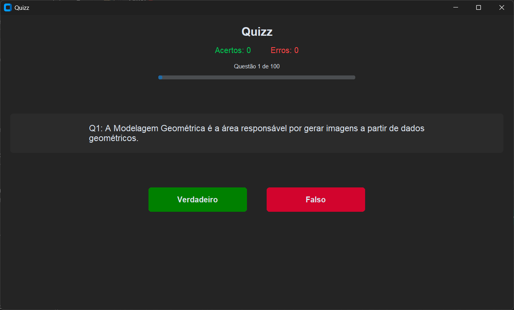

# QuizzV

# Python Quiz Application

This is a simple desktop quiz application built with Python and the **customtkinter** library.  
It allows users to load questions from a CSV file, answer them in a true or false format, and review their results.  
The application provides immediate feedback and the option to redo only the questions that were answered incorrectly.

## Features

- **Customizable Questions**: Load questions from any CSV file with the correct format.
- **True/False Format**: A straightforward and easy-to-use quiz style.
- **Progress Tracking**: A progress bar and counter show your current position in the quiz.
- **Scoreboard**: Displays your correct and incorrect answers in real-time.
- **Instant Feedback**: After each question, you receive a detailed justification for the correct answer.
- **Review Mode**: At the end of the quiz, you can choose to restart the full quiz or practice only the questions you got wrong.
- **Modern UI**: A clean and modern user interface using the customtkinter library.

## Interface



## Project Structure

```
.
├── build/                 # Build directory (if you create an executable)
├── dist/                  # Distribution directory with the executable
│   └── quiz_app.exe       # The compiled application for Windows
├── questoes/              # Directory for quiz question files
│   ├── questoes_CG.csv
│   ├── questoes_PDI.csv
│   └── questoes_SO.csv
├── quizz-icon.ico         # Application icon
└── quiz_app.py            # Main application script
```

The core of the application is **quiz_app.py**, which contains all the logic for the quiz interface and functions.  
The **questoes/** directory holds the CSV files with the questions.

## CSV File Format

The application reads questions from a semicolon-delimited (`;`) CSV file.  
The file must have a header row with three columns: **enunciado**, **resposta**, and **justificativa**.

- **enunciado**: The text of the question or statement to be evaluated.
- **resposta**: The correct answer. It must be either `True` or `False`.
- **justificativa**: The explanation or justification for the correct answer.

### Example of CSV format

```csv
enunciado;resposta;justificativa
"The capital of Brazil is Brasília.";True;"Brasília was officially established as the capital of Brazil in 1960.";
"The Earth is the third planet from the Sun.";True;"The order of the planets from the Sun is Mercury, Venus, Earth, and Mars.";
"Water boils at 100°F at sea level.";False;"Water boils at 100°C (212°F) at standard atmospheric pressure.";
```

> **Note**: It is important to enclose values containing commas or semicolons within double quotes (`"`).

## How to Run

There are two ways to run the quiz application:

### Option 1: Using the Executable

For users who don't have Python installed, you can simply run the compiled executable file.

1. Navigate to the **dist** folder.
2. Double-click on **quiz_app.exe** to launch the application.
3. A file dialog will open, prompting you to select one of the CSV files from the **questoes/** folder to start the quiz.

### Option 2: Running from Source Code

For developers or users who want to run the application from the source code, follow these steps:

1. Clone this repository to your local machine.
2. Make sure you have Python installed.
3. Install the required library `customtkinter`:

```bash
pip install customtkinter
```

4. Run the main application script from your terminal:

```bash
python quizz.py
```

5. A file dialog will open, prompting you to select one of the CSV files from the **questoes/** folder to start the quiz.

---

## Table of Contents

- [Python Quiz Application](#python-quiz-application)
- [Features](#features)
- [Project Structure](#project-structure)
- [CSV File Format](#csv-file-format)
- [How to Run](#how-to-run)
  - [Option 1: Using the Executable](#option-1-using-the-executable)
  - [Option 2: Running from Source Code](#option-2-running-from-source-code)

**Victor Kauan**

[](https://github.com/victor-kauan-coder)
[](https://www.linkedin.com/in/victor-miranda-5342a6337)
